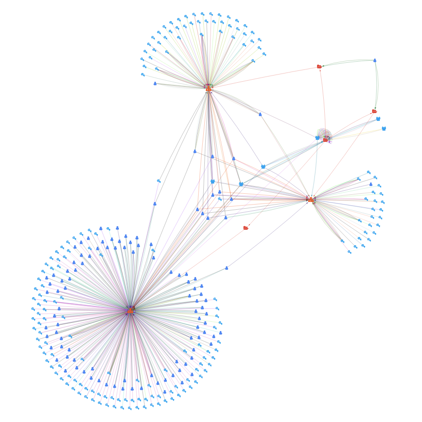
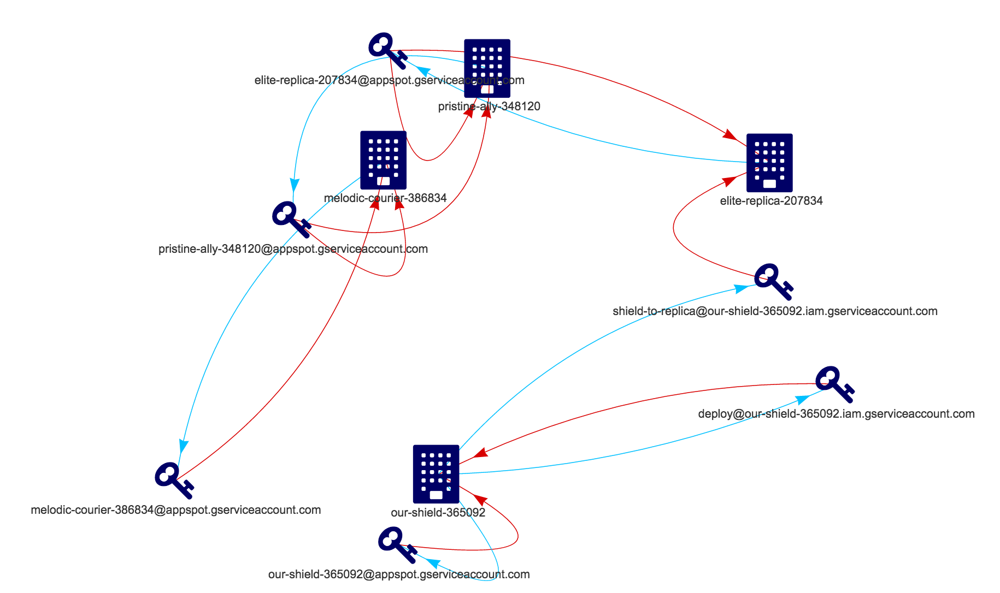

# GCP IAM Visualizer

Creates an interactive graph of Google Cloud Platform (GCP) IAM policies, allowing for easier exploration of complex IAM structures.

Uses Python 3 to construct a static HTML page using [vis.js](http://visjs.org/).

Currently supports:
* IAM policies assigned to folders
* IAM policies assigned to projects
* User Accounts (members)
* Service Accounts
* Groups
* Filtering by users, user types, groups and roles




# Getting started

## Initial steps

### 1. Install dependencies
* [Google Cloud CLI](https://cloud.google.com/sdk/gcloud/)

### 2. Configure [Google Application Default Credentials](https://developers.google.com/identity/protocols/application-default-credentials)
```
gcloud auth application-default login
```

If necessary, set the `GOOGLE_APPLICATION_CREDENTIALS` environment variable to point to the location of the created credentials file.

**Example**
```
export GOOGLE_APPLICATION_CREDENTIALS=~/.config/gcloud/application_default_credentials.json
```

### 3. Set the collection scope

Set the environment variable `IAM_GRAPH_SCOPE` to determine the hierarchical starting point from where policies should be collected. This must be a folder or an organization. Use the standard Google API format, e.g. `organizations/93823423523` or `folders/9382372422`.

**Example**
```
export IAM_GRAPH_SCOPE='organizations/83747734232'
```

By setting the scope to an organization or folder, IAM policies for all contained folders and projects will be collected, recursively.

# Run it
The easiest way is to run it as an ephemeral Docker container.

<details open>
  <summary>Docker</summary>

### 1. Install dependencies
* [Docker](https://docs.docker.com/get-docker/)

### 2. Build it and run it

```
# Build the Docker image
docker build -t gcp-iam-graph .

# Run the Docker image
docker run -it --rm \
--name gcp-iam-graph \
-e IAM_GRAPH_SCOPE="${IAM_GRAPH_SCOPE}" \
-e GOOGLE_APPLICATION_CREDENTIALS=/tmp/keys/credentials.json \
-v $GOOGLE_APPLICATION_CREDENTIALS:/tmp/keys/credentials.json:ro \
-p 8080:8080 \
gcp-iam-graph
```

This will first start data collection, construct the graph, then serve it on a local webserver on [localhost:8080](http://localhost:8080).

This message means data collection is finished, and that the webserver is ready:
```
Serving HTTP on 0.0.0.0 port 8080 (http://0.0.0.0:8080/) ...
```
</details>
<details>
  <summary>Python (development)</summary>

### 1. Install dependencies
**Requires Python 3 and PIP.**

```
pip install --no-cache-dir -r src/requirements.txt
```

### 2. Create the graph

```
python3 src/create_graph.py ${IAM_GRAPH_SCOPE} index.html
```

### 3. Start a simple Python webserver (optional)
You can also open the HTML file in a browser.

```
python3 -m http.server 8080
```
</details>


# Attributions
This project is based on [gcp-iam-collector](https://github.com/marcin-kolda/gcp-iam-collector) by Marcin Kolda.